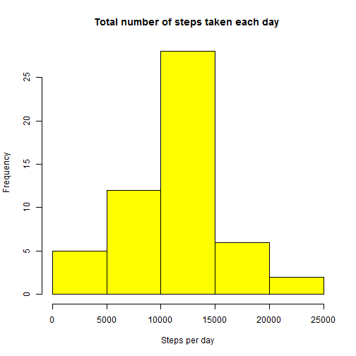
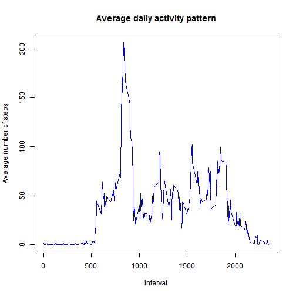
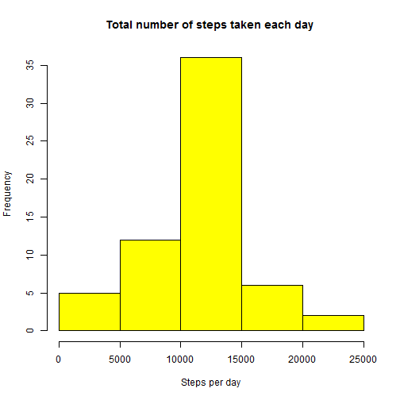
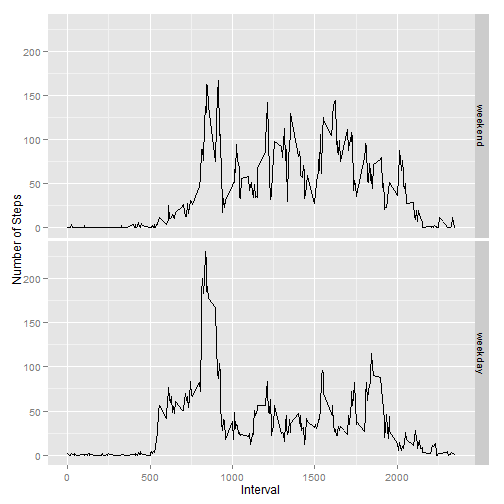

# Reproducible Research: Peer Assessment 1
By rromeror

## Loading and preprocessing the data
The data is loaded as follows,

```r
unzip("activity.zip")
data <- read.csv("activity.csv") 
head(data,3)
```

```
##   steps       date interval
## 1    NA 2012-10-01        0
## 2    NA 2012-10-01        5
## 3    NA 2012-10-01       10
```
As there are missing values "NA", these are then removed so as to get a tidy data set,

```r
tidy_data <- data[!is.na(data$steps), ]
head(tidy_data,3)
```

```
##     steps       date interval
## 289     0 2012-10-02        0
## 290     0 2012-10-02        5
## 291     0 2012-10-02       10
```
## What is mean total number of steps taken per day?
From the tidy data, the mean total number of steps taken per day is,

```r
steps_day <- tapply(tidy_data[,1],tidy_data[,2],sum)
mean_steps_day <- mean(steps_day,na.rm = TRUE)
mean_steps_day
```

```
## [1] 10766
```
The median of the total number of steps taken per day is,

```r
median_steps_day <- median(steps_day,na.rm = TRUE)
median_steps_day
```

```
## [1] 10765
```
A histogram of the total number of steps taken each day is,

```r
hist(steps_day,col="yellow",main = "Total number of steps taken each day ",xlab="Steps per day")
```

 

## What is the average daily activity pattern?
The average daily pattern can be calculated by melting the data set and then calculating the average number of steps per interval,

```r
library(reshape2)
melt_data <- melt(tidy_data,id=c("interval"),measure.vars=c("steps"))
daily_activity <- dcast(melt_data,interval~variable,mean)
```
The corresponding time series is,

```r
plot(daily_activity$interval,daily_activity$steps,type="l",col="blue",ylab="Average number of steps",xlab="interval")
title("Average daily activity pattern")
```

 

```r
head(daily_activity,5)
```

```
##   interval   steps
## 1        0 1.71698
## 2        5 0.33962
## 3       10 0.13208
## 4       15 0.15094
## 5       20 0.07547
```
The interval that contains the maximum number of steps is,

```r
interval <- daily_activity[daily_activity$steps == max(daily_activity[,2]),1]
interval
```

```
## [1] 835
```
## Imputing missing values
The total number of missing values of the raw data set is given by,

```r
missing_values <- sum(!complete.cases(data))
missing_values
```

```
## [1] 2304
```
The missing values of the original raw data set are now filled in with the average number of steps per interval. Therefore, a new tidy data set is created by adding the average values per interval contained in the "daily_activity" data frame. The new clean data is obtained as follows, 

```r
new_data <- data
na_rows <- !complete.cases(new_data)
num_meas_day <- summary(new_data[na_rows,2])
new_data[na_rows,"steps"] <- rep(daily_activity$steps,length(num_meas_day[num_meas_day!=0]))
```
From the new tidy data set,the mean total number of steps taken per day is,

```r
steps_day <- tapply(new_data[,1],new_data[,2],sum)
mean_steps_day <- mean(steps_day,na.rm = TRUE)
mean_steps_day
```

```
## [1] 10766
```
The median of total number of steps taken per day is,

```r
median_steps_day <- median(steps_day,na.rm = TRUE)
median_steps_day
```

```
## [1] 10766
```
The histogram of the total number of steps taken each day for the new tidy data set is,

```r
hist(steps_day,col="yellow",main = "Total number of steps taken each day ",xlab="Steps per day")
```

 

As shown, the total mean and median do not change as the chosen strategy adds "new measurements" which equal the average values previously calculated. Moreover, the histogram has been slightly modified due to the new "observations" added to the interval containing the total mean. As seen, the relative frequency of this interval (10000,15000) increases.
## Are there differences in activity patterns between weekdays and weekends?
Using the new data set a factor vector is created. It defines "weekday" and "weekend" as levels which indicate the type of day for each date in the new tidy data set. The factor is created as follows,

```r
library(timeDate)
day_type <- isWeekday(as.Date(new_data[,"date"]))
day_type <- factor(day_type)
levels(day_type) <- c("weekend","weekday")
```
Now the average number of steps per interval and type of day, i.e. either "weekday" or "weekend" is calculated,

```r
new_data1 <- data.frame(new_data,day = day_type)
melt_data <- melt(new_data1,id=c("interval","day"),measure.vars=c("steps"))
daily_activity <- dcast(melt_data,day + interval~variable,mean)
head(daily_activity)
```

```
##       day interval    steps
## 1 weekend        0 0.214623
## 2 weekend        5 0.042453
## 3 weekend       10 0.016509
## 4 weekend       15 0.018868
## 5 weekend       20 0.009434
## 6 weekend       25 3.511792
```
The plot per type of day is,

```r
library(ggplot2)
qplot(interval,steps,data = daily_activity,geom="line",facets=day~.,xlab = "Interval",ylab="Number of Steps")
```

 

As seen, there are differences. First, on the weekdays the average numberof steps is higher as compared to the weekends for intervals less than 1000. These results are likely to follow the activity pattern of weekday (going to work, school, etc.) vs weekend (sleeping, resting,etc.) mornings. However, the results are (mainly) opposite for intervals higher than 1000; this is due to the fact that in weekday afternoons people are more likely to be sedentary than on the weekends.

